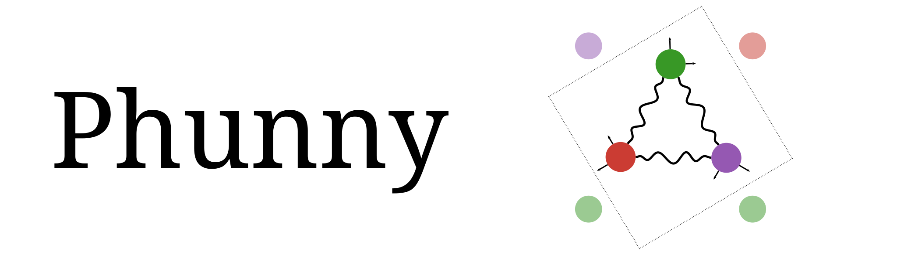

    <picture>
      <source media="(prefers-color-scheme: dark)" srcset="docs/src/assets/dark-mode-banner.svg">
      
    </picture>

<!---
TODO: Add stable version 

 --->

## Empirical Lattice Dynamics for Neutron Scattering

Phunny.jl is a constraint-preserving, empirical lattice dynamics framework for effective model discovery from experimental spectroscopic data. Rather than deriving force constants from first principles, Phunny constructs the minimal symmetry-constrained, gauge-fixed effective force-constant manifold consistent with available experimental constraints such as elastic constants, Raman/IR frequencies, THz and neutron scattering data, and phonon dispersion curves.

Working entirely in the primitive cell, Phunny assembles a real-space force constant matrix Φ(R) encoded as a dictionary of dense 3×3 blocks keyed by bonds, supporting both two-body bond-stretching interactions (longitudinal/transverse decomposition) and three-body angular bond-bending interactions. The mass-weighted dynamical matrix is constructed by direct Fourier summation at arbitrary continuous wavevectors, avoiding supercell finite-size approximations entirely. Diagonalization of the mass-weighted dynamical matrix yields phonon eigenfrequencies and polarization vectors from which Phunny computes:

- One-phonon coherent dynamic structure factor along wavevector paths and full 4D grids
- Anisotropic Debye-Waller tensors may be computed directly from the phonon spectrum
- Per-site mean-squared displacements with quantum corrections
- Phonon group velocities via analytic gradient perturbation theory

While the primary representation is the primitive cell by default, Phunny supports passing the conventional cell and allows supercell construction if requested at the time of model construction. Atomic bonds and interactions can be discovered autonomously or explicitly set by the user, allowing both exploration and fine-tuned control.

Physical constraints such as translational invariance (acoustic sum rule), Hermiticity, Newton's third law, and rotational consistency are enforced structurally rather than as penalties. Built-in databases provide natural-abundance, isotopic atomic masses, and neutron coherent scattering lengths for the full periodic table so that only the atomic label is required. Each autonomous look-up permits the default atom such as `:O` for oxygen or an isotope such as `(:O, 17)` by passing the atomic label with the isotope mass number.

Phunny integrates with Sunny.jl for crystal geometry and reciprocal space utilities, and is designed as a forward simulator within a broader inference loop coupling to PHysicalTDA.jl and Phenomenal.jl for topology-aware effective model discovery directly from large-bandwidth inelastic neutron scattering datasets. Spin-phonon coupling is being explored and will be included in the future.
